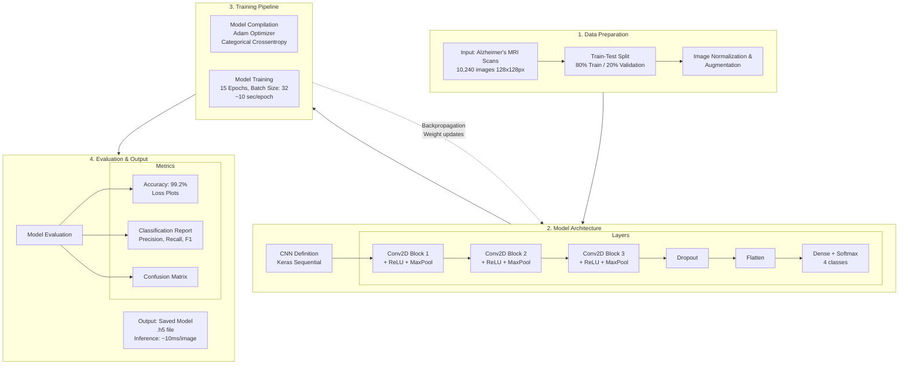

# Alzheimer's Disease Detection using Convolutional Neural Networks

A deep learning-based approach for detecting and classifying different stages of Alzheimer's disease using MRI brain scans. This project implements a Convolutional Neural Network (CNN) to classify brain MRI images into four categories representing different stages of cognitive decline.

---

## 🧠 Project Overview

Alzheimer's disease is a progressive brain disorder where early diagnosis is critical for effective management. This project leverages Artificial Intelligence (AI) to build a powerful diagnostic tool that can automatically analyze and interpret brain MRI scans, providing a fast, non-invasive, and reliable aid for medical professionals.

## 🎯 Objectives

- **Develop and implement** a Convolutional Neural Network (CNN) model capable of accurately detecting Alzheimer's disease from MRI scans
- **Train the CNN model** on a dataset of MRI images to learn the key features associated with different stages of Alzheimer's
- **Create a classification system** that can effectively classify brain MRI images into categories: Non-Demented, Very Mild Demented, Mild Demented, and Moderate Demented
- **Evaluate model performance** and achieve high levels of accuracy, precision, and recall in detecting the disease
- **Build a practical tool** that can potentially assist radiologists and doctors in the early and accurate diagnosis of Alzheimer's disease, leading to better patient outcomes

## 📊 Key Features

- **Multi-class Classification**: Classifies MRI scans into 4 distinct stages of Alzheimer's disease
- **High Accuracy**: Achieves 99.2% validation accuracy on test dataset
- **Fast Inference**: ~10ms per image prediction
- **Efficient Training**: Complete training in under 3 minutes
- **Deployable Model**: Saved as portable .h5/Keras file for real-world integration
- **Comprehensive Evaluation**: Multiple metrics including accuracy, loss plots, confusion matrix, and classification reports

## 🏗️ Model Architecture

### CNN Design

The model consists of three convolutional blocks for feature extraction, followed by dense layers and Softmax activation for classification:

1. **Convolutional Block 1**: Conv2D + ReLU + MaxPooling2D
2. **Convolutional Block 2**: Conv2D + ReLU + MaxPooling2D
3. **Convolutional Block 3**: Conv2D + ReLU + MaxPooling2D
4. **Dropout Layer**: Regularization to prevent overfitting
5. **Flatten Layer**: Converts 2D features to 1D vector
6. **Dense Layers**: Fully connected layers with Softmax activation (4 classes)

### Workflow Diagram



## 📈 Performance Metrics

### Training Performance
- **Dataset Size**: 10,240 MRI Scans (128×128 pixels)
- **Batch Size**: 32
- **Epochs**: 15
- **Average Time per Epoch**: ~10 seconds
- **Total Training Time**: 2 minutes 50 seconds

### Hardware Utilization
- **GPU**: NVIDIA RTX 3070 Ti (8GB VRAM)
- **Peak GPU Utilization**: 98%
- **Peak VRAM Usage**: 5.4 GB / 8.0 GB

### Model Performance
- **Final Validation Accuracy**: 99.2%
- **Validation Set Size**: 100 images
- **Inference Time**: ~10ms per image

## 🛠️ Technologies Used

- **Python**: Core programming language
- **TensorFlow/Keras**: Deep learning framework
- **NumPy**: Numerical computations
- **Pandas**: Data manipulation
- **Matplotlib/Seaborn**: Data visualization
- **scikit-learn**: Metrics and evaluation

## 📋 Requirements

```
tensorflow>=2.0.0
keras>=2.0.0
numpy>=1.19.0
pandas>=1.0.0
matplotlib>=3.0.0
seaborn>=0.11.0
scikit-learn>=0.24.0
```

## 🚀 Getting Started

### Installation

1. Clone the repository:
```bash
git clone https://github.com/Bugaddr/alzheimer_detection.git
cd alzheimer_detection
```

2. Install required packages:
```bash
pip install -r requirements.txt
```

### Dataset Preparation

Organize your MRI images into the following structure:
```
data/
├── train/
│   ├── NonDemented/
│   ├── VeryMildDemented/
│   ├── MildDemented/
│   └── ModerateDemented/
└── test/
    ├── NonDemented/
    ├── VeryMildDemented/
    ├── MildDemented/
    └── ModerateDemented/
```

### Usage

1. **Run the notebook**: Open and execute `alzheimer_detection.py`
2. **Data Preprocessing**: Images are normalized and split into 80% training and 20% validation
3. **Model Training**: Train the CNN for 15 epochs (~3 minutes on RTX 3070 Ti)
4. **Evaluation**: View comprehensive metrics and classification reports
5. **Save Model**: Export trained model as `.h5` file

```python
# Example: Load and use the trained model
from tensorflow import keras
import numpy as np
from PIL import Image

# Load the trained model
model = keras.models.load_model('alzheimer_cnn_model.h5')

# Prepare an image for prediction
img = Image.open('path/to/mri_scan.jpg')
img = img.resize((128, 128))
img_array = np.array(img) / 255.0
img_array = np.expand_dims(img_array, axis=0)

# Make prediction
prediction = model.predict(img_array)
classes = ['NonDemented', 'VeryMildDemented', 'MildDemented', 'ModerateDemented']
predicted_class = classes[np.argmax(prediction)]
confidence = np.max(prediction) * 100

print(f"Prediction: {predicted_class}")
print(f"Confidence: {confidence:.2f}%")
```

## 📁 Project Structure

```
alzheimer_detection/
│
├── alzheimer_detection.ipynb    # Main Jupyter notebook
├── README.md                     # Project documentation
├── requirements.txt              # Python dependencies
├── models/                       # Saved model files
│   └── alzheimer_cnn_model.h5
├── data/                         # Dataset directory
│   ├── train/
│   └── test/
└── results/                      # Output plots and reports
    ├── accuracy_plot.png
    ├── loss_plot.png
    ├── confusion_matrix.png
    └── classification_report.txt
```

## 📚 Literature Review

Our approach is informed by recent advances in deep learning for Alzheimer's detection:

1. **Al-Mourabit et al. (2021)** - Confirmed CNNs as state-of-the-art for AD detection, highlighting challenges like limited datasets and model interpretability
2. **Suk et al. (2014)** - Demonstrated deep feature learning superiority over handcrafted features for AD/MCI classification
3. **Payan & Montana (2015)** - Pioneered 3D CNNs for capturing spatial brain context in neuroimaging
4. **Falahati et al. (2014)** - Established MRI-based biomarkers using classical machine learning approaches
5. **Li et al. (2019)** - Used hippocampal MRI analysis for early AD prediction

## 🌟 Impact & Implications

### Medical Impact
- **Accelerates Early Diagnosis**: Empowers clinicians with an AI-powered tool to detect Alzheimer's disease at its earliest stages, critical for effective patient management
- **Improves Diagnostic Accuracy & Efficiency**: Acts as a reliable "second opinion" for medical experts, reducing human error and speeding up diagnostic workflows
- **Enhances Patient Outcomes**: Earlier, more accessible diagnosis allows patients and families crucial time to plan care, explore treatments, and improve quality of life

### Technical Impact
- **Scalable AI Foundation**: Serves as a blueprint for developing similar AI-driven diagnostic tools for other neurological disorders
- **Proof of Concept**: Demonstrates successful application of deep learning for medical image analysis
- **Real-World Deployment Ready**: Portable model format enables integration into existing healthcare systems

## 🤝 Contributing

Contributions are welcome! Please feel free to submit a Pull Request. For major changes, please open an issue first to discuss what you would like to change.

1. Fork the Project
2. Create your Feature Branch (`git checkout -b feature/AmazingFeature`)
3. Commit your Changes (`git commit -m 'Add some AmazingFeature'`)
4. Push to the Branch (`git push origin feature/AmazingFeature`)
5. Open a Pull Request

## 📝 References

[1] C. Al-Mourabit, M. Abdel-Nasser, and A. Valls, "A literature review of deep learning in Alzheimer's disease," *IEEE Journal of Biomedical and Health Informatics*, vol. 25, no. 1, pp. 1–14, 2021.

[2] H.-I. Suk, S.-W. Lee, and D. Shen, "Deep learning-based feature representation for AD/MCI classification," in *Proc. Int. Conf. Medical Image Computing and Computer-Assisted Intervention (MICCAI)*, 2014, pp. 583–590.

[3] A. Payan and G. Montana, "Predicting Alzheimer's disease: A neuroimaging study with 3D convolutional neural networks," *arXiv preprint arXiv:1502.02506*, 2015.

[4] F. Falahati, E. Westman, and A. Simmons, "Multivariate data analysis and machine learning in Alzheimer's disease with a focus on structural magnetic resonance imaging," *Journal of Alzheimer's Disease*, vol. 41, no. 3, pp. 685–708, 2014.

[5] H. Li, M. Habes, D. A. Wolk, and Y. Fan, "A deep learning model for early prediction of Alzheimer's disease dementia based on hippocampal magnetic resonance imaging," *Alzheimer's & Dementia*, vol. 15, no. 8, pp. 1059–1070, 2019.

## ⚠️ Disclaimer

This project is for educational and research purposes only. It should **not be used as a substitute for professional medical diagnosis**. The model is a proof-of-concept and has not been clinically validated. Always consult with qualified healthcare professionals for medical advice and diagnosis.

## 📜 License

This project is open source and available under the [MIT License](LICENSE).

## 🙏 Acknowledgments

- Dataset providers and the medical imaging community
- TensorFlow and Keras development teams
- Research community working on Alzheimer's disease detection
- Department of Electronics & Communication Engineering, Ramdeobaba College of Engineering and Management

---

**Note**: Early detection of Alzheimer's disease can significantly improve patient outcomes. This project demonstrates the potential of AI-assisted medical diagnostics and aims to contribute to advancing healthcare technology.
